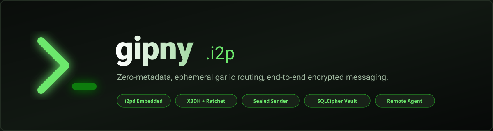
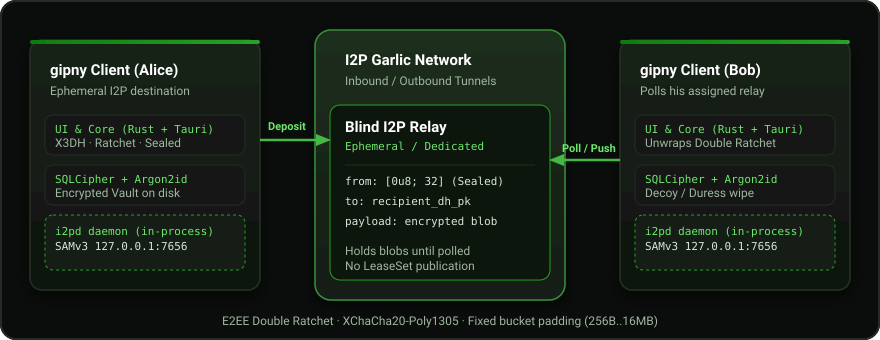
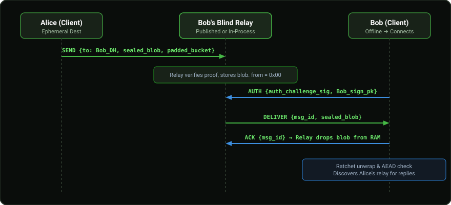

<div align="center">



<br/>

[](https://github.com/gluckdev/gipny-i2p/actions/workflows/build.yml)
[](https://github.com/gluckdev/gipny-i2p/actions/workflows/e2e-i2pd.yml)
[](https://github.com/gluckdev/gipny-i2p/actions/workflows/codeql.yml)
[](https://www.rust-lang.org/)
[](LICENSE)

<p align="center">
  <b>Анонимный десктопный и мобильный мессенджер со сквозным шифрованием поверх сети I2P.</b><br/>
  Без телефонных номеров, без email, без логинов и паролей на серверах.<br/>
  Идентификатор — только криптографическая пара ключей. Сетевой I2P-адрес — <b>строго эфемерный</b> на каждую сессию.
</p>

[Ключевые особенности](#-ключевые-особенности) •
[Что умеет приложение](#-что-умеет-приложение) •
[Архитектура](#-архитектура-и-транспорт) •
[Протокол доставки](#-протокол-слепой-доставки) •
[Сборка и запуск](#-сборка-и-запуск) •
[Безопасность](#-модель-безопасности) •
[Оговорки](#-честные-технические-оговорки) •
[Агент и бот](#-агент-и-бот--в-чём-разница)

</div>

---

> ℹ️ **О форке gipny-i2p:**
> Это I2P-форк оригинального мессенджера gipny. Сетевой транспорт полностью переведён с Tor (Arti) на **I2P** (на базе встроенного C++ роутера `i2pd` и протокола SAMv3). Криптографическое ядро, схема Double Ratchet, зашифрованный вольт SQLCipher и интерфейс сохранены.
> Подробная история перехода зафиксирована в [MIGRATION-i2p.md](MIGRATION-i2p.md).

---

## ⚡ Ключевые особенности

```
          ┌──────────────────────────────────────────────────────────┐
          │                   gipny-i2p Стек                         │
          ├──────────────────────────┬───────────────────────────────┤
          │ 🛡️ Криптография          │ X3DH + Double Ratchet         │
          │                          │ XChaCha20-Poly1305, Ed25519   │
          ├──────────────────────────┼───────────────────────────────┤
          │ 🧅 Сеть и Анонимность    │ Встроенный i2pd (SAMv3)       │
          │                          │ Эфемерные адреса, publish:false│
          ├──────────────────────────┼───────────────────────────────┤
          │ 💾 Защита на диске       │ SQLCipher (AES-256) + Argon2id│
          │                          │ Duress-пароль / Decoy профиль │
          ├──────────────────────────┼───────────────────────────────┤
          │ 📡 Релей и Метаданные    │ Sealed Sender (from = 0x00)   │
          │                          │ Фиксированные корзины паддинга│
          ├──────────────────────────┼───────────────────────────────┤
          │ 🕸️ Сеть релеев           │ Kademlia, записи шифрованы     │
          │                          │ и подписаны, ключи по суткам  │
          ├──────────────────────────┼───────────────────────────────┤
          │ 🤖 Автономный агент      │ Удалённая консоль в чате      │
          │                          │ Встроенный Bot SDK для ботов  │
          └──────────────────────────┴───────────────────────────────┘
```

- 🔒 **Zero-Knowledge для серверов (Sealed Sender):** Релей не знает, кто отправляет сообщение (`from = [0u8; 32]`). На проводе видны только хэш получателя и зашифрованный блоб фиксированной размерной сетки (256 Б ... 16 МиБ).
- 🌐 **Встроенный I2P-роутер (`i2pd`):** Не нужно настраивать сторонние демоны или прокси. Приложение поднимает легковесный `i2pd` в фоне (или через JNI на Android) и работает через SAMv3.
- 🎭 **Эфемерный сетевой след:** Адрес узла генерируется заново при каждом запуске сессии (`DEST GENERATE`) и хранится только в `Zeroizing`-памяти. На диск сетевой адрес не пишется, а `publish: false` гарантирует, что ваш LeaseSet не публикуется в публичной NetDB.
- ⚡ **У каждого свой релей:** адрес релея отправителя едет внутри зашифрованного конверта каждого сообщения, поэтому маршрут для ответов обновляется сам, без обмена новыми карточками.
- 🕸️ **Сеть релеев:** релеи клиентов образуют распределённую сеть. Если релей получателя молчит, письмо запечатывается и остаётся в сети до недели, пока адресат не включит приложение; оттуда же берутся его новый адрес и ключи для первого сообщения. Хранящий узел видит только шифротекст под ключом, который меняется каждые сутки.
- 🏠 **Встроенный релей в процессе:** приложение поднимает собственный релей при запуске — сторонний сервер не нужен, настраивать нечего.
- 💼 **Защита от физического давления (Duress & Anti-Forensics):**
  - Возможность задать альтернативный пароль под принуждением: запуск с фейковой базой (**Decoy**) либо экстренное затирание всех ключей в несколько проходов.
  - Лимит попыток ввода: автоматический wipe профиля при брутфорсе.
  - Память процессов защищена (`mlock`, запрет core dump).
- 🤖 **Удалённый агент и боты без интерфейса:** выполнение команд из чата доверенного мастера и SDK на Rust для своих ботов (`bot-sdk`).

---

## 🧾 Что умеет приложение

Полный список того, что есть в текущей версии. В скобках — версия, в которой
это появилось; заметки к каждой версии лежат в [`docs/releases/`](docs/releases/)
и на [странице релизов](https://github.com/gluckdev/gipny-i2p/releases).

**Переписка**

- Личные чаты и группы: создание группы, участники, отдельные счётчики
  непрочитанного (0.4.0).
- Вложения: файлы и картинки до 16 МиБ, галерея «медиа и файлы» по чату,
  вставка картинки из буфера обмена, сохранение на диск (0.4.0).
- Ответы на сообщение, правки, удаление, пересылка в другой чат, закрепление
  сообщений и чатов (0.4.0).
- Исчезающие сообщения: срок жизни от 5 минут до 7 дней, удаляется у обоих
  (0.4.0). Закреплённые сообщения из очистки исключены.
- Поиск по всем сообщениям (FTS5 внутри зашифрованной базы) (0.4.0).
- Индикатор набора текста, отметки «отправлено» и «доставлено», уведомления со
  звуком, режим «без уведомлений» по чату (0.4.0).
- Кнопки под сообщениями (инлайн-клавиатуры) для ботов (0.4.0).

**Контакты**

- Карточка контакта: два открытых ключа и адрес релея, без телефона и почты
  (0.4.0).
- Запросы в контакты: добавили карточку — у человека появляется запрос
  «принять / отклонить / заблокировать»; до принятия ваши сообщения ему не
  показываются (0.4.3).
- Проверка по отпечатку ключей, метка «проверенный», блокировка, метка «бот»
  (0.4.0).
- Папки контактов: свои, сворачиваемые, с переносом контакта через его меню
  (0.4.4).
- Аватарки: персонаж японских гравюр XIX века каждому контакту, случайно и с
  возможностью сменить (0.4.4).
- Обмен карточками по QR: свой код в «моей карточке», сканирование камерой при
  добавлении контакта (0.4.6).
- Сброс сессии шифрования для контакта, если сообщения перестали доходить
  (0.4.0).

**Доставка**

- Встроенный релей у каждого клиента, новый адрес при каждом запуске, почта и
  prekey-пакет только владельца (0.4.2).
- Внешний выделенный релей как альтернатива — ящик, который принимает почту,
  пока приложение закрыто (0.4.0).
- Повторная отправка неподтверждённого письма до 7 дней (0.4.3).
- Сеть релеев: узлы находят друг друга и публикуют свои адреса для контактов
  (0.4.4); отправка и сбор писем через сеть, когда релей собеседника молчит, и
  подтверждаемое обновление адреса (0.4.5).

**Приватность и защита**

- Сквозное шифрование X3DH + Double Ratchet, XChaCha20-Poly1305 (0.4.0).
- Скрытый отправитель: релей не знает, кто написал (0.4.0).
- Паддинг до фиксированных корзин от 256 Б до 16 МиБ (0.4.0).
- Очистка метаданных у вложений (EXIF в картинках, служебные поля PDF) —
  *Настройки → Приватность* (0.4.2).
- Зашифрованный профиль: SQLCipher (AES-256) и Argon2id, несколько профилей на
  устройстве (0.4.0).
- Пароль под принуждением: пустой профиль-обманка или экстренное затирание;
  лимит неверных попыток с автоматическим затиранием (0.4.0).
- Резервная копия: экспорт в зашифрованный файл и импорт в новый профиль
  (0.4.0).
- Страница «О gipny и безопасности» — что именно и как защищено, с честными
  ограничениями (0.4.4).

**Сеть и обновления**

- Встроенный роутер i2pd в каждой сборке, на Android — внутри приложения
  (0.4.0).
- Настройки роутера: доля транзитного трафика, Yggdrasil (выключен /
  автоматически / всегда) (0.4.0).
- Обязательное автообновление через сеть i2p, с проверкой контрольной суммы, и
  перезапуск одним нажатием; на Android — проверка через i2p, установка APK
  вручную (0.4.0, обязательным стало в 0.4.5).
- Состояние сети релеев в настройках: сколько узлов известно, сколько хранится
  для других, роль устройства (0.4.4).
- Журнал работы со временем в каждой строке, включён по умолчанию, вместе с
  журналом прошлого запуска; выключатель и просмотр в настройках (0.4.6).

**Интерфейс**

- Оформление как у привычного мессенджера: аватарки, имя и статус в списке,
  «пузыри» со временем и галочками (0.4.4).
- Светлая и тёмная темы и «как в системе» (0.4.0).
- Раскладка для телефона и планшета, сворачиваемая панель чатов (0.4.1).
- Русский интерфейс (0.4.4).
- Видимый запуск профиля: этапы, время каждого, технические подробности,
  «открыть чаты сейчас» (0.4.6).
- «Кофеин»: экран не гаснет, чат не переключается, выход по паролю (0.4.6).

**Автоматизация**

- Режим агента: доверенный контакт («мастер») выполняет команды на вашей машине
  прямо из чата (0.4.0).
- `gipny-agent` — то же самое без интерфейса, для сервера (0.4.0), со своим
  встроенным релеем (0.4.2) и автообновлением (0.4.2).
- `bot-sdk` — крейт для своих ботов (0.4.0).

### Версии

| Версия | Про что она | Заметки |
|---|---|---|
| [0.4.8](https://github.com/gluckdev/gipny-i2p/releases/tag/v0.4.8) | «Назад» на Android прячет приложение, а не роняет его вместе с роутером | [0.4.8.md](docs/releases/0.4.8.md) |
| [0.4.7](https://github.com/gluckdev/gipny-i2p/releases/tag/v0.4.7) | Android больше не падает на проверке обновлений; обновление нельзя подменить чужим корневым сертификатом | [0.4.7.md](docs/releases/0.4.7.md) |
| [0.4.6](https://github.com/gluckdev/gipny-i2p/releases/tag/v0.4.6) | Видимый запуск профиля, отправка без ожидания своего релея, перезапуск умершего роутера, QR карточки, журнал работы, «кофеин» | [0.4.6.md](docs/releases/0.4.6.md) |
| [0.4.5](https://github.com/gluckdev/gipny-i2p/releases/tag/v0.4.5) | Доставка через сеть релеев, контакт не теряется при смене адреса, обязательные обновления | [0.4.5.md](docs/releases/0.4.5.md) |
| [0.4.4](https://github.com/gluckdev/gipny-i2p/releases/tag/v0.4.4) | Новый вид, папки контактов, аватарки, страница «О gipny», узлы сети релеев находят друг друга | [0.4.4.md](docs/releases/0.4.4.md) |
| [0.4.3](https://github.com/gluckdev/gipny-i2p/releases/tag/v0.4.3) | Запросы в контакты, повторы до 7 дней, привязка входа на релей к самому релею | [0.4.3.md](docs/releases/0.4.3.md) |
| [0.4.2](https://github.com/gluckdev/gipny-i2p/releases/tag/v0.4.2) | Встроенный релей по умолчанию, у агента тоже; очистка метаданных вложений | [0.4.2.md](docs/releases/0.4.2.md) |
| [0.4.1](https://github.com/gluckdev/gipny-i2p/releases/tag/v0.4.1) | Починка запуска роутера на десктопе, раскладка для телефона | [0.4.1.md](docs/releases/0.4.1.md) |
| [0.4.0](https://github.com/gluckdev/gipny-i2p/releases/tag/v0.4.0) | Первая версия на i2pd, релей в карточке контакта, режим агента, macOS и ARM | [0.4.0.md](docs/releases/0.4.0.md) |

---

## 🏛️ Архитектура и транспорт

Сетевой стек gipny полностью изолирован от прямого доступа к IP-сети:

<div align="center">
  
</div>

### Как взаимодействуют компоненты:
1. **Ядро (Rust Core + Tauri):** Управляет сессиями, ключами X3DH, хранилищем сообщений в SQLCipher и шифрованием.
2. **Локальный SAMv3-мост (`127.0.0.1:7656`):** Ядро общается с `i2pd` исключительно через сокет SAMv3 при помощи крейта `yosemite`.
3. **Чесночные туннели:** `i2pd` строит исходящие туннели через распределенную сеть узлов I2P.
4. **Android NDK/JNI:** На смартфонах роутер компилируется как нативная библиотека `libi2pd.so` и работает внутри Android Foreground Service (`GipnyService.kt`).

---

## 📨 Протокол «слепой» доставки

В отличие от традиционных P2P-мессенджеров, где оба собеседника обязаны держать опубликованный адрес и быть одновременно онлайн:

<div align="center">
  
</div>

### Этапы передачи:
1. **Депозит:** Алиса упаковывает сообщение по схеме Double Ratchet, дополняет паддингом до стандартизированной корзины и передает на релей Боба с указанием `recipient_dh_pk`. Отправитель скрыт.
2. **Офлайн-буфер:** Релей хранит зашифрованный блоб в памяти (или временном хранилище).
3. **Авторизация получателя:** Боб подключается к своему релею, подтверждает владение ключом через криптографический `AUTH challenge`.
4. **Выдача и ACK:** Релей пушит накопившиеся блобы Бобу. После подтверждения получения (`ACK`) релей безвозвратно удаляет блоб.

**Откуда Алиса знает релей Боба.** Из его карточки контакта (`gipny:v2:…:<relay>`), а дальше — из самих сообщений: каждое сообщение (кроме индикаторов набора) несёт внутри шифрованного конверта адрес релея отправителя, и клиент обновляет его у контакта, если он изменился. Поменяли релей в настройках — контакты узнают об этом с первым же вашим сообщением, новую карточку рассылать не нужно. Подделать адрес нельзя: он приходит внутри сессии Double Ratchet этого контакта.

**Встроенный релей (по умолчанию).** Настраивать ничего не нужно: каждое приложение при запуске поднимает релей внутри себя и получает почту через него. Адрес этого релея создаётся заново при каждом запуске и нигде не сохраняется — постоянного адреса, по появлениям которого в сети можно было бы вычислить часы вашей активности, не существует. Релей личный: он хранит письма и prekey-пакет только своего владельца и отказывает всем остальным. После запуска релею нужно 1–2 минуты на постройку туннелей; затем приложение само сообщает новый адрес всем, с кем уже есть переписка.

**Когда релей получателя молчит — письмо идёт через сеть релеев.** Встроенный релей живёт вместе с приложением, поэтому адресата может не быть на месте. В этом случае клиент запечатывает письмо и оставляет его в сети релеев (`dht/`, `libcore/src/dht_client.rs`): узлы хранят шифротекст до семи дней под ключом, который никто, кроме этих двух собеседников, не вычислит. Адресат забирает письмо при следующем запуске, подтверждает получение и удаляет его из сети. Оттуда же берутся его текущий адрес (если он перезапускался) и prekey-пакет для самого первого сообщения.

**Контакт не теряется, новая карточка не нужна.** Адрес релея меняется при каждом запуске, но приложение повторяет объявление нового адреса — через релей собеседника или через сеть — пока от него что-нибудь не придёт: только это доказывает, что адрес дошёл. Переписка и ключи при этом не меняются.

Нужен ящик, который принимает почту, пока вас нет совсем, — переключите *Настройки → Релей* на **«внешний»** и укажите адрес выделенного релея (см. «Запуск собственного выделенного релея»). У `gipny-agent` то же самое: личный встроенный релей по умолчанию, `--relay` — внешний.

---

## 🗺️ Карта проекта: куда вносить правки

В каждом каталоге лежит свой `README.md`: что там за файлы, какая задача каким файлом решается, что надо менять вместе и как проверить. Начинайте с него, а не с поиска по всему проекту.

| Каталог | Что это | Путеводитель |
|---|---|---|
| `libcore/` | Общее ядро: криптография, сессии Double Ratchet, база, протокол релея, встроенный релей, роутер i2pd, автообновление | [libcore/README.md](libcore/README.md) |
| `core/` | Приложение на Tauri (десктоп и Android): `Core`, команды для интерфейса, запуск профиля | [core/README.md](core/README.md) |
| `core/gen/android/` | Android-обёртка: сервис, манифест, ресурсы | [core/gen/android/README.md](core/gen/android/README.md) |
| `android-router/` | Сборка i2pd для Android (JNI) | [android-router/README.md](android-router/README.md) |
| `core/relay/` | Выделенный релей `gipny-relay` (отдельный workspace) | [core/relay/README.md](core/relay/README.md) |
| `dht/` | Сеть релеев: ключи, запечатывание, протокол узлов, хранилище | [dht/README.md](dht/README.md) |
| `ui/` | Интерфейс (TypeScript без фреймворка), dev-превью с моками | [ui/README.md](ui/README.md) |
| `agent/` | `gipny-agent` — headless-агент с удалённой консолью | [agent/README.md](agent/README.md) |
| `bot-sdk/` | Bot SDK | [bot-sdk/README.md](bot-sdk/README.md) |
| `tests/e2e-harness/` | Сквозные тесты по живой сети i2p | [tests/e2e-harness/README.md](tests/e2e-harness/README.md) |
| `.github/workflows/` | CI, релизы, e2e, тестовый релей, скрипты заметок к релизу | [.github/workflows/README.md](.github/workflows/README.md) |
| `tools/` | Утилиты для отладки роутера и SAM | [tools/README.md](tools/README.md) |
| `docs/` | Документы: решения, планы, заметки к релизам, передача дел | [docs/README.md](docs/README.md) |
| `third_party/` | Сабмодули `i2pd` и `i2pd-android` — не править руками, пин двигает CI | — |

Правило: поменяли структуру каталога, добавили файл или перенесли ответственность — поправьте его `README.md` в том же коммите.

---

## 📦 Сборка и запуск

Все бинарные сборки и тесты автоматически собираются в [GitHub Actions CI](https://github.com/gluckdev/gipny-i2p/actions).

### Системные требования:
- **Rust:** `stable` (рекомендуется `rustup update`)
- **Node.js:** 18+ и `npm`
- **C++ компилятор, OpenSSL, Boost** (для компиляции встроенного `i2pd`)

### 1. Локальная сборка под Linux:

```bash
# Клонирование с сабмодулями (i2pd)
git clone --recursive https://github.com/gluckdev/gipny-i2p.git
cd gipny-i2p

# Установка системных зависимостей (Debian/Ubuntu)
sudo apt install -y build-essential pkg-config curl git \
    libssl-dev libgtk-3-dev libwebkit2gtk-4.1-dev \
    libayatana-appindicator3-dev librsvg2-dev libsoup-3.0-dev \
    libasound2-dev nodejs npm

# Сборка встроенного i2pd
make -C third_party/i2pd USE_UPNP=no USE_GIT_VERSION=yes -j"$(nproc)"
mkdir -p core/resources
cp third_party/i2pd/i2pd core/resources/

# Сборка фронтенда
cd ui && npm install && npm run build && cd ..

# Запуск в dev-режиме
cd core
GIPNY_I2P_BIN=$PWD/resources/i2pd cargo run
```

### 2. Запуск собственного выделенного релея:

Ни приложению, ни `gipny-agent` он не обязателен — у каждого есть личный встроенный. Выделенный релей нужен, когда почта должна приниматься, пока приложение (или агент) закрыто: люди в разных часовых поясах, телефон, который усыпляет приложение.

```bash
# Сборка релей-сервера
cargo build --release -p gipny-relay

# Запуск (подключится к запущенному SAMv3 на порту 7656)
GIPNY_RELAY_DATA=/var/lib/gipny-relay ./target/release/gipny-relay
```
*При первом запуске релей выведет свой публичный I2P Destination (Base64), который можно вставить в настройках мессенджера.*

---

## 📊 Сравнение и бенчмарки

Результаты сквозного end-to-end тестирования в реальной сети I2P ([Workflow run 35075367552](https://github.com/gluckdev/gipny-i2p/actions/workflows/e2e-i2pd.yml)):

| Параметр | Значение в gipny-i2p | Примечание |
| :--- | :--- | :--- |
| **Успешность доставки** | **100% (5 из 5)** | Проверено через два изолированных headless-бота |
| **Медианный RTT доставки** | **~5.8 секунд** | Сквозной путь через I2P-туннели и слепой релей |
| **Время прогрева туннелей** | **~45-60 секунд** | Однократный reseed при холодном старте |
| **Утечка IP-адреса** | **0% (Исключено)** | Приложение не открывает прямых сокетов в WAN |
| **Публикация LeaseSet** | **Отключена (`publish:false`)** | Полное отсутствие в публичной поисковой таблице DHT |

---

## 🛡️ Модель безопасности

| Уровень защиты | Что защищает | Остаточные риски |
| :--- | :--- | :--- |
| **Личность** | Ключи Ed25519 + X25519. Нет телефонных номеров, почты, никнеймов. | Публичный ключ является постоянным идентификатором для добавленных контактов. |
| **Сеть (I2P)** | Входящие/исходящие туннели с чесночным шифрованием. Сокрытие реального IP. | Теоретические атаки тайминга при контроле глобального провайдера. |
| **Сервер (Релей)** | Sealed Sender — релей слеп к отправителю, видит только зашифрованные пакеты. | Владелец релея видит часы, когда за почтой приходят. |
| **Сеть релеев** | Хранящий узел видит только шифротекст под ключом, который меняется каждые сутки; получателя, отправителя и размер точнее корзины — нет. | Держатель вашей карточки видит объём запросов в ваш «ящик для первых писем». |
| **Содержимое** | X3DH + Double Ratchet + XChaCha20-Poly1305 (Forward Secrecy + Post-Compromise Security). | Компрометация разблокированного устройства с живыми ключами в RAM. |
| **Диск** | SQLCipher (AES-256) + Argon2id. Эфемерные I2P-ключи **не сохраняются** на диск. | Снятие дампа RAM методом cold-boot атаки при физическом захвате. |
| **Метаданные** | Выравнивание длины пакетов по фиксированным корзинам (размер не выдает тип контента). | Размерная корзина разделяет трафик на классы (текст vs медиафайл). |

---

## ⚠️ Честные технические оговорки

1. **Независимый аудит:** Криптографический стек использует общепринятые алгоритмы (Dalek-криптографию, XChaCha20-Poly1305), однако формального коммерческого внешнего аудита безопасности пока не проводилось.
2. **Холодный старт I2P:** Первое подключение при пустом кэше NetDB требует 1–2 минут для поиска пиров и построения чесночных туннелей.
3. **Одно активное устройство:** Концепция Signal Double Ratchet требует синхронного счетчика сообщений. Не используйте один и тот же приватный ключ на двух активных устройствах одновременно (для переноса используйте экспорт бэкапа с закрытием старого клиента).
4. **Сеть релеев молодая и небольшая:** письмо для того, кто не в сети, доживёт до него, только если его сохранит хотя бы один узел — а узлы это в основном приложения обычных людей. Поиск в сети идёт через i2p и занимает десятки секунд, поэтому это запасной путь: пока собеседник в сети, письма идут прямо на его релей. Android только пользуется сетью и не хранит чужие данные: система усыпляет приложение. Выделенный внешний релей по-прежнему надёжнее всего.
5. **Android-сборки:** Сборка под Android компилируется и проверяется в CI, но требует тестирования на широком парке вендорских прошивок из-за агрессивных менеджеров энергосбережения в Android.
6. **Автообновление ходит на GitHub через внешний i2p-outproxy** (`exit.stormycloud.i2p`), а не напрямую: приложение и агент не светят свой настоящий IP перед GitHub, но полагаются на сторонний узел, который видит, что кто-то сейчас обращается к api.github.com (содержимое — нет, там TLS). Проверка идёт в фоне сама, без вопросов; результат ставится сразу, но запускается только со следующего запуска. Отключить — *Настройки → обновляться автоматически*. У api.github.com лимит 60 запросов в час на IP без токена, и этот IP у outproxy общий на всех, кто через него сейчас ходит — в час пик проверка может молча не пройти и повториться позже, это не авария.

## 🤝 Агент и бот — в чём разница

Оба — обычные аккаунты gipny без человека за клавиатурой, с тем же сквозным
шифрованием. Разница в том, **кому они подчиняются и что делают**.

| | **Агент** (`gipny-agent`, режим агента) | **Бот** (`bot-sdk`) |
|---|---|---|
| Зачем | управлять машиной из чата: посмотреть логи, перезапустить сервис, забрать файл | отвечать людям: уведомления, справки, интеграции, кнопки |
| С кем говорит | **только с одним мастером**, чью карточку ему дали; всем остальным не отвечает | **с кем угодно**, запросов в контакты у ботов нет — он принимает всех |
| Что выполняет | команды оболочки на своей машине, строго по одной, с таймаутом и рабочим каталогом | только ваш код: обработчики `on_message`, `on_command`, `on_callback` |
| Кто пишет логику | никто: агент уже готов, логика — это ваши команды в чате | вы, на Rust, поверх `gipny_bot::Bot` |
| Как включается | мастеру приходит `GRANT`; выключить может и мастер, и сам агент (`OFF`, `REVOKE`) | просто запускается как программа |
| Где живёт | отдельный бинарь на сервере **или** любое приложение gipny, которому включили *Настройки → Режим агента* | ваша программа, где угодно |
| Риск | мастер получает выполнение команд на устройстве — включайте только тому, кому доверяете машину | ограничен тем, что вы написали в обработчиках |
| Документация | [agent/README.md](agent/README.md), раздел ниже | [bot-sdk/README.md](bot-sdk/README.md), [bot-sdk/docs.md](bot-sdk/docs.md) |

Короче: **агент — это ваш доступ к машине через чат** (одна доверенная сторона,
произвольные команды), **бот — это сервис для людей** (много собеседников,
только заранее написанные действия). Общего у них только транспорт: у агента и у
бота есть свой личный релей, эфемерный адрес и та же криптография, что у
приложения.

---

## 🕹️ Режим агента и удалённая консоль

Одной из ключевых возможностей gipny является превращение клиента в **удалённого управляемого агента** или запуск выделенного сервера в фоновом headless-режиме через сквозной шифрованный канал I2P.

```
┌─────────────────┐       E2EE I2P Tunnel       ┌──────────────────┐
│  Master Client  │ ───────────────────────────▶│  Agent Machine   │
│ (Desktop / App) │   CONSOLE_COMMAND "uptime"  │ (CLI or App GUI) │
│                 │                             │                  │
│  Terminal View  │ ◀───────────────────────────│ Executes Command │
│  shows stdout   │   CONSOLE_OUTPUT "load:..." │ in Sandbox / OS  │
└─────────────────┘                             └──────────────────┘
```

### 1. Включение режима агента в GUI (Desktop / Android)
Вы можете дать право доверенному контакту («Мастеру») запускать команды на вашей машине:
1. Перейдите в **Настройки → Режим агента**.
2. Выберите контакт, которому доверяете управление (он должен быть заранее добавлен в контакты).
3. Нажмите **«Включить режим агента»**.
4. Клиент автоматически отправит мастеру служебное сообщение `GRANT`.
5. В переписке с вами у мастера появится режим терминала: мастер отправляет команды, а вы видите поток их выполнения.
6. Выключить режим может **как агент, так и мастер** в любой момент одной кнопкой.

> ⚠️ *На Android команды выполняются в изолированной песочнице приложения.*

> ⚠️ *Команды, которые контакт прислал, пока режим был выключен, сохраняются и **выполняются сразу после включения** режима для этого контакта. Включайте режим только для того, кому доверяете устройство.*

---

### 2. Автономный headless-демон (`gipny-agent`)
Для серверов, домашних микрокомпьютеров (Raspberry Pi) или удалённых хостов доступен отдельный CLI-бинарь **`gipny-agent`**:
- Не требует графического интерфейса или Webview.
- Сам запускает `i2pd` из своего архива (ищет его рядом с собой), получает эфемерный адрес и ждёт команды мастера.
- Выполняет shell-команды от имени пользователя, под которым запущен, с настраиваемым таймаутом и рабочей директорией.

Агент поднимает для себя личный релей при каждом запуске, точно как приложение — настраивать ничего не нужно, и почта агента не хранится ни на чьём чужом релее. `--relay` — необязательный внешний адрес, для тех, кому нужен почтовый ящик, принимающий команды, пока агент выключен.

Карточку мастера копируйте прямо перед первым запуском: при встроенном релее мастера адрес в ней действует до перезапуска его приложения; после первого контакта агент следит за адресом мастера сам.

Архив `gipny-agent_<версия>_linux-<arch>.tar.gz` со страницы релиза содержит `gipny-agent`, `i2pd`, юнит `gipny-agent.service` и `README.txt` с шагами установки.

**Запуск руками:**
```bash
tar xzf gipny-agent_*_linux-amd64.tar.gz && cd gipny-agent_*/
./gipny-agent \
  --data ~/.gipny-agent \
  --master "gipny:v2:<i2p_destination>:<sign_pk>:<dh_pk>:<relay>" \
  --name "prod-server-01"
```

`--master` нужен один раз: карточка сохраняется в `<data>/master.card`, дальше агент читает её оттуда (передать снова — сменить мастера). То же для необязательного `--relay` — он сохраняется в `<data>/relay.txt`. Каталог `--data` можно задать переменной `GIPNY_AGENT_DATA`; в нём же `card.txt` с карточкой самого агента и `agent.db` без пароля — каталог создаётся с правами `0700`.

**Как служба** (Linux, от root): бинари в `/usr/local/bin`, юнит в `/etc/systemd/system`, карточка мастера в `/etc/gipny-agent.env` строкой `GIPNY_AGENT_ARGS=--master gipny:v2:…`, затем `systemctl enable --now gipny-agent`. Подробно — в `README.txt` архива. Команды выполняются строго по одной, в порядке получения; «выключить агента» со стороны мастера завершает процесс.

Когда роутер поднимется, агент напечатает свою карточку (`agent card: gipny:v2:...`) и первым напишет мастеру. **Вводить карточку в приложение не нужно**: контакт с консолью появится у мастера сам, как только агент до него достучится.

---

## 🤖 Bot SDK

Для разработки ботов и интеграций предоставляется готовый легковесный крейт:

```rust
use gipny_bot::{Bot, BotTarget};

#[tokio::main]
async fn main() -> anyhow::Result<()> {
    Bot::builder()
        .data_dir("./bot-data")
        .display_name("echo-bot")
        .on_command("ping", |ctx, _arg| async move {
            ctx.reply("pong! 🏓").await?;
            Ok(())
        })
        .build()?
        .run().await
}
```
*Подробнее смотрите в документации [bot-sdk/docs.md](bot-sdk/docs.md).*

---

<div align="center">
  <sub>Лицензия: GPL-3.0 • Разработано для свободного и приватного общения в сети I2P.</sub>
</div>
